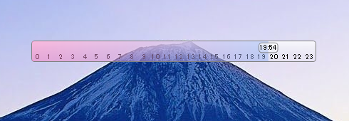

# Shortokei.xaml

## 概要
ほぼxamlだけバー時計（時刻合わせに1行だけコードビハインドを使用）

時計がバーに付いていきつつはみ出さないハックが見どころ。

## 使用ライブラリ
[NuGet Gallery | Microsoft.Xaml.Behaviors.Wpf 1.1.19](https://www.nuget.org/packages/Microsoft.Xaml.Behaviors.Wpf/1.1.19?_src=template)

## ライセンス
CC0 1.0 Universal

## 注意事項
* 時計の誤差は通常1秒以内
* バーの誤差は未確認
* 一切責任は持ちません